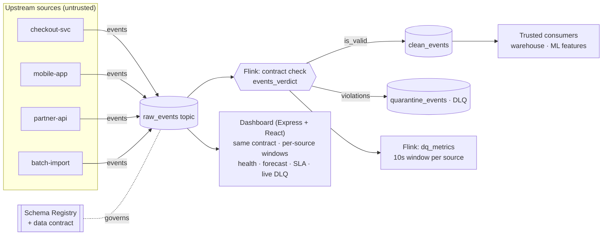

# StreamGuard · Architecture

A shift-left, real-time **data quality firewall** built entirely on Confluent
Cloud. It sits between untrusted producers and trusted consumers, enforcing data
contracts, quarantining violations, and forecasting quality degradation before
it reaches production systems.

## Dataflow

The Flink pipeline enforces the contract, routes clean/quarantine, and computes
per-source windowed metrics. The dashboard applies the **identical contract** to
`raw_events`, windows it per source, and derives the OK/WATCH/BREACH status and
error-rate forecast — guaranteeing a continuously live serving view. (Confluent
Cloud's managed Flink ran the forecast-into-a-materialized-table variant as a
bounded job, so the live view is computed in the serving layer; same rules, same
10s windows.)

## Components

| Layer | Tech | Responsibility |
| --- | --- | --- |
| Ingest | Kafka topic `raw_events` | Untrusted firehose from all sources. |
| Governance | Schema Registry / data contract | Wire-format schema on `raw_events`. |
| Firewall | Flink SQL views (`events_checked`, `events_verdict`) | Evaluate semantic contract rules per event. |
| Routing | Flink materialized tables (`clean_events`, `quarantine_events`) | Trusted lane + dead-letter lane with reasons. |
| Metrics | Flink materialized table `dq_metrics` | Per-source, per-window quality scorecard. |
| Serving + forecast | Node/Express + SSE backend, Vite + React client | Applies the same contract to `raw_events`, windows per source, derives OK/WATCH/BREACH + forecast, live health board / chart / DLQ feed. |
| Simulation | Node producer | Baseline valid traffic + escalating violations on one source. |

## The contract (semantic rules)

Enforced in `02_contract_check.sql`. Schema Registry guards the *wire format*;
these guard the *meaning*, which is where real data-quality incidents live.

| Rule | Violation code |
| --- | --- |
| `event_id` present | `MISSING_EVENT_ID` |
| `user_id` present | `MISSING_USER_ID` |
| `0 <= amount <= 100000` | `AMOUNT_OUT_OF_RANGE` |
| `currency ∈ {USD,EUR,GBP,JPY,INR}` | `INVALID_CURRENCY` |
| `event_ts` parseable timestamp | `MALFORMED_TIMESTAMP` |
| freshness ≤ 300s | `STALE_EVENT` |

## Why these design choices signal streaming expertise

- **Event-time windowing with watermarks** (`TUMBLE` on the record time) — late
  and out-of-order events are handled correctly, which matters because a
  degrading source often gets laggy at the same time.
- **Dead-letter queue, never silent drops** — rejected records are preserved
  with their failed rules so they can be triaged and replayed after the upstream
  bug is fixed. This is the pattern serious streaming teams run.
- **Contracts as executable SQL** on top of Schema Registry — captures semantic
  rules (ranges, enums, freshness) that a plain schema can't express.
- **Forecasting the *quality metric itself*** — not the business data, but the
  reliability of the data. Projecting each source's error-rate trend forward
  turns monitoring from reactive to proactive (WATCH before BREACH).

## Confluent pillar mapping

| Pillar | Where |
| --- | --- |
| Connectors / producers | Stream events into `raw_events`. |
| Stream processing (Flink) | Contract check, clean/quarantine routing, per-source windowed metrics. |
| Stream Governance | JSON Schema registered in Schema Registry, enforced on `raw_events`. |
| Forecasting | Per-source error-rate trend projected forward to raise WATCH before the SLA breach. |
